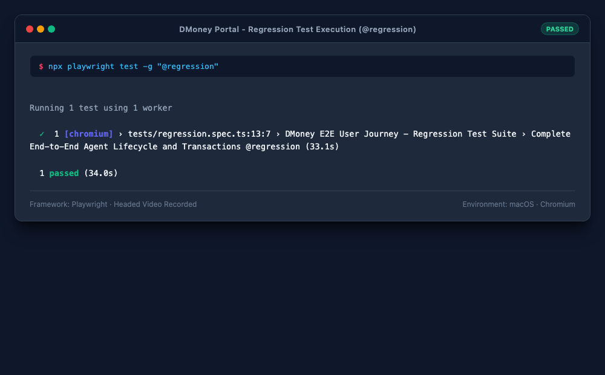
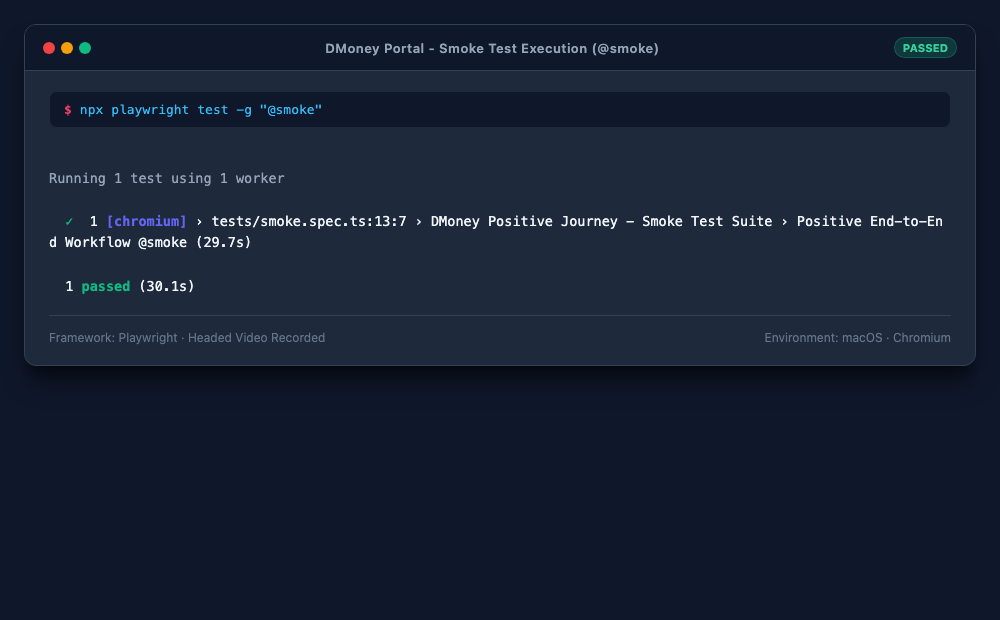

# DMoney Portal — End-to-End Test Automation (Playwright)

Automated end-to-end test suite for the **dMoney Mobile Financial Service (MFS) Portal** using **Playwright** and TypeScript, architected with the **Page Object Model (POM)** pattern.

- **Target Application URL:** [https://dmoneyportal.roadtocareer.net](https://dmoneyportal.roadtocareer.net)
- **Framework:** Playwright Test (`@playwright/test`)
- **Language:** TypeScript / Node.js
- **Pattern:** Page Object Model (POM)

---

## 📌 Project Architecture (POM)

The repository follows a clean, modular Page Object Model architecture:

```
├── .gitignore
├── auth.json                     # Session storage state at project root
├── package.json
├── playwright.config.ts           # Playwright configuration with storageState & video
├── pages/                         # Page Object Model classes
│   ├── BasePage.ts                # Shared navigation, avatar, balance & logout actions
│   ├── RegisterPage.ts            # User registration form & assertions
│   ├── LoginPage.ts               # Login, OTP verification & session storage
│   ├── AdminUsersPage.ts          # Admin user search, details & status activation
│   ├── CashInPage.ts              # System & Agent deposit/cash-in workflows
│   ├── ResetPasswordPage.ts       # Forgot password request & token-based reset
│   └── SelfStatementPage.ts       # Transaction history filters, table extraction & CSV export
├── utils/                         # Helper utilities
│   ├── testData.ts                # Dynamic agent data generator & credentials
│   ├── apiHelper.ts               # Backend API helper for OTP, reset tokens & customer selection
│   └── csvHelper.ts               # CSV formatter, exporter, and validator
├── tests/                         # Test suites
│   ├── regression.spec.ts         # Full end-to-end regression suite (@regression)
│   └── smoke.spec.ts              # Positive critical path smoke suite (@smoke)
├── assets/                        # Test execution screenshots
│   ├── regression_test_result.png
│   └── smoke_test_result.png
├── recordings/                    # Headed automation video recordings
│   └── dmoney_e2e_automation.webm
└── self_statement_2026-10-07.csv  # Extracted statement CSV file
```

---

## 🔁 Automated User Journey

1. **Agent Registration:** Navigate to the Sign Up page and register a new user with the `Agent` role using valid details.
2. **Admin Verification & Activation:**
   - Log in as Admin (`admin@dmoney.com` / `1234`).
   - Save session into `auth.json`.
   - Search for the newly created Agent and verify the initial status is inactive (`PENDING`).
   - Edit the Agent and activate the account (`ACTIVE`).
   - Reload the page and verify the Agent remains `ACTIVE`.
   - Log out from Admin.
3. **System Deposit to Agent:**
   - Log in using System account (`system@dmoney.com` / `1234`).
   - Deposit `2000 Tk` into the Agent account.
   - Verify transaction completion, Transaction ID generation, and success confirmation.
   - Log out from System account.
4. **Agent Login & Customer Transaction:**
   - Log in as the newly activated Agent (verifying email 2FA OTP).
   - Verify the Agent balance is exactly `2000 Tk`.
   - Deposit `500 Tk` to an existing active Customer account.
   - Verify successful transaction record and commission update.
   - Verify the Agent balance is updated correctly.
   - Log out from Agent account.
5. **Password Reset Flow:**
   - Request password reset on the Forgot Password page.
   - Retrieve the secure reset token and navigate to the reset password page.
   - Set a new password for the Agent.
   - Verify that login with the old password fails.
   - Log in using the newly reset password with OTP.
6. **Self Statement Extraction:**
   - Navigate to the Self Statement section.
   - Filter transactions to include today's records.
   - Extract all table rows and verify both the System deposit and Customer transfer records exist.
   - Export all statement data into `self_statement_YYYY-MM-DD.csv`.

---

## ✅ Test Coverage Checklist

| # | Validation Requirement | Status |
|---|---|:---:|
| 1 | Verify Agent registration is successful | Passed |
| 2 | Verify newly created Agent is initially inactive (`PENDING`) | Passed |
| 3 | Verify Admin login is successful | Passed |
| 4 | Verify newly created Agent appears in Admin user list | Passed |
| 5 | Verify Admin can activate the Agent | Passed |
| 6 | Verify the Agent remains active after page reload | Passed |
| 7 | Verify System login is successful | Passed |
| 8 | Verify System can deposit 2000 Tk to the Agent | Passed |
| 9 | Verify System deposit creates the correct transaction record | Passed |
| 10 | Verify Agent can log in after activation | Passed |
| 11 | Verify Agent balance is exactly 2000 Tk | Passed |
| 12 | Verify Agent can deposit 500 Tk to an existing Customer | Passed |
| 13 | Verify Agent balance is updated correctly after transaction | Passed |
| 14 | Verify Customer deposit appears in Agent's Self Statement | Passed |
| 15 | Verify Agent logout works successfully | Passed |
| 16 | Verify Agent password reset works successfully | Passed |
| 17 | Verify login with old password fails after password reset | Passed |
| 18 | Verify login with new password succeeds | Passed |
| 19 | Verify Self Statement contains expected transaction data | Passed |
| 20 | Verify Self Statement data is saved into required CSV file | Passed |

---

## 🔐 Session Storage (`auth.json`)

Session state storage is integrated as required:
- Storage state is configured in `playwright.config.ts`:
  ```ts
  use: {
    storageState: 'auth.json',
  }
  ```
- After successful user logins, the session cookies and local storage tokens are saved directly to `auth.json` at the project root using `page.context().storageState({ path: 'auth.json' })`.

---

## 🚀 How to Run the Tests

### 1. Prerequisites
- Node.js (v18 or higher)
- npm

### 2. Install Dependencies
```bash
npm install
npx playwright install chromium
```

### 3. Run Regression Test Suite
Runs the full end-to-end regression suite covering all 20 validations:
```bash
npm run test:regression
```

### 4. Run Smoke Test Suite
Runs the smoke test suite covering the positive happy path:
```bash
npm run test:smoke
```

### 5. Run in Headed Mode with Video Recording
```bash
npm run test:record
```

### 6. View Playwright HTML Report
```bash
npx playwright show-report
```

---

## 🎥 Full Automation Video Recording

The complete end-to-end user journey has been recorded in headed mode.

- **Video File:** [recordings/dmoney_e2e_automation.webm](recordings/dmoney_e2e_automation.webm)

> To view the recording, open the `.webm` file directly in any modern browser or media player (e.g., Chrome, Firefox, or VLC).

---

## 📊 Regression Test Result

Execution output of the full regression suite (`@regression`):



---

## ⚡ SmokeTest Result

Execution output of the positive smoke suite (`@smoke`):



---

## 📄 Extracted Self Statement CSV

The extracted transaction history is saved dynamically at the project root following the required naming convention: `self_statement_todays_date.csv`.

**Example:** `self_statement_2026-10-07.csv`

```csv
Transaction ID,Sender Account,Receiver Account,Type,Debit,Credit,Balance,Date
TXNWJB2NKXY57,SYSTEM,01722493822,Top-up from SYSTEM,-,2000.00,2000.00,"07/10/2026, 01:35:28"
TXNVAHSGLYZVP,01722493822,01655233072,Deposit Commission,500.00,12.50,1512.50,"07/10/2026, 01:35:33"
```

---

## 📧 Gmail API Integration

Integrated with the official **Google Gmail REST API** to list incoming messages, read email contents, and parse authentication OTP codes and password reset tokens in real time.

### Endpoints Used
- **List Messages:**
  ```http
  GET https://gmail.googleapis.com/gmail/v1/users/me/messages
  ```
- **Read Message Details:**
  ```http
  GET https://gmail.googleapis.com/gmail/v1/users/me/messages/{{messageId}}
  ```

### Usage

1. **Read Latest Email (CLI):**
   ```bash
   npm run read:email
   ```
   Or query by subject/sender:
   ```bash
   node scripts/read_latest_email.js "Password Reset"
   ```

2. **Run Gmail Playwright Test:**
   ```bash
   npm run test:gmail
   ```

3. **In Test Code (`utils/gmailHelper.ts`):**
   ```ts
   import { GmailHelper } from '../utils/gmailHelper';

   const gmail = new GmailHelper();

   // List messages
   const messages = await gmail.listMessages('from:salman@roadtocareer.net', 5);

   // Read latest email
   const email = await gmail.readMessage(messages[0].id);

   // Extract OTP
   const otp = await gmail.waitForLatestOtp();
   ```


